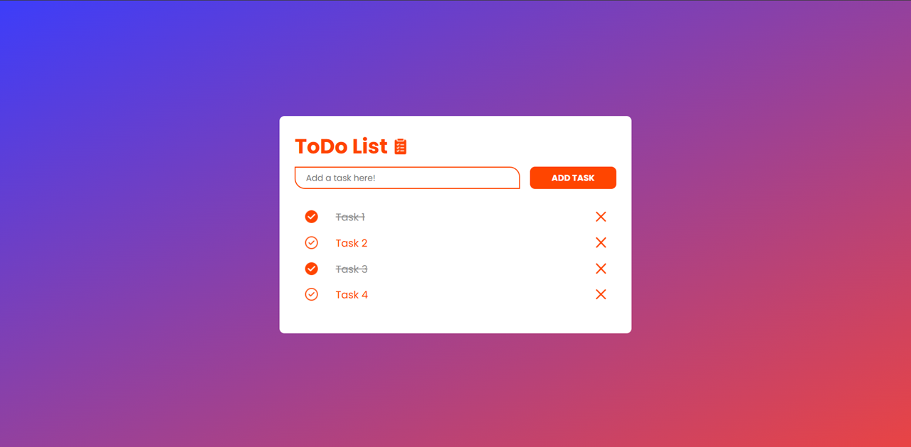

# Simple Todo List
A simple todo list application to practice and improve my javascript skills

# What I learned
This project helps me strengthen my understanding of DOM manipulation, especially in event handling and local storage in Javascript

# Screenshot

# Features
- Add, edit, delete tasks
- Mark tasks as completed
- Store task in local storage

# Built with 
- HTML 5
- SASS
- Flexbox
- Vanilla Javascript